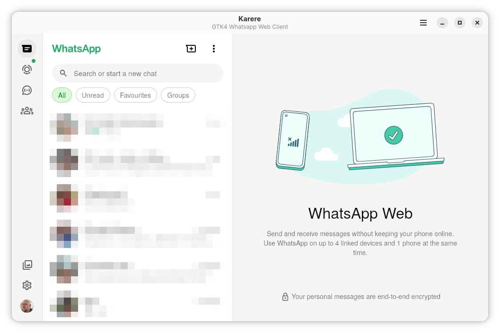
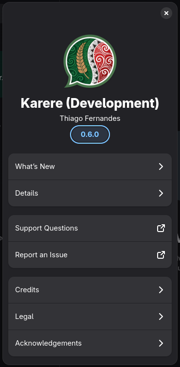
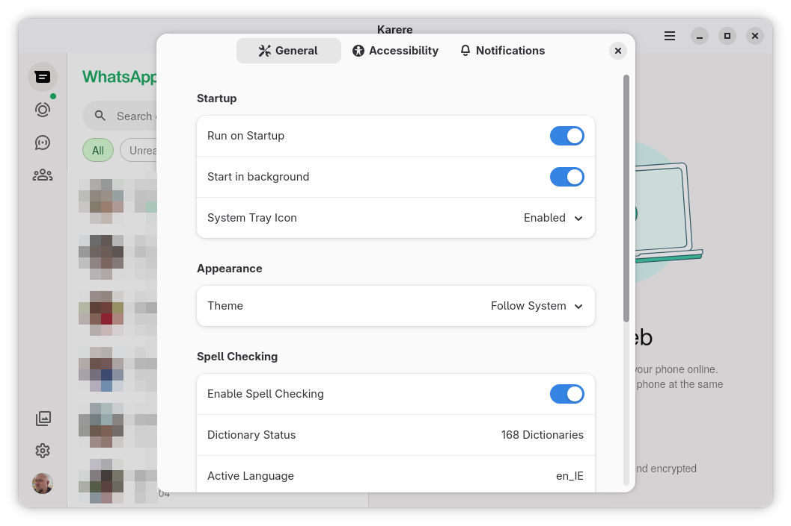
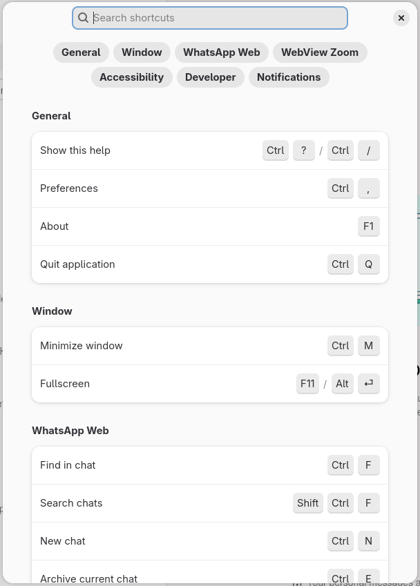

# Karere

> **Multi-account & identity discovery.** Each account runs in an isolated CEF `RequestContext`; accounts are listed most-recently-used (no manual ordering), and existing v3 accounts must be re-linked (no migration). Account name and avatar are discovered from WhatsApp Web's internal `Store` through a Webpack hook (the same technique as `@wppconnect/wa-js`).
>
> **Degraded-mode contract.** If a future WhatsApp release restructures its Webpack bundle and the Store hook can't attach, the affected account falls back to scraping the DOM (`#side header`) for its name and avatar, and its switcher row shows a **persistent yellow "degraded mode" badge**. The badge does **not** clear when the DOM fallback succeeds — it is cleared only when a later page load lets the Store hook attach successfully again (typically after the hook is updated for the new WhatsApp release). The badge is intentional: it surfaces the fragile scrape path so it gets fixed rather than silently masking breakage.

A fast, native WhatsApp client for Linux that feels right at home on your desktop.

<div align="center">



<a href="https://flathub.org/en/apps/io.github.tobagin.karere"></a>
<a href="https://ko-fi.com/tobagin"></a>

</div>

## 🎉 Version 4.2 — CEF/Chromium 150

**Karere 4.0** is a ground-up rewrite that swaps the rendering backend from WebKitGTK to the
**Chromium Embedded Framework (CEF/Chromium 150)** while keeping the same native
GTK4/libadwaita shell. It is a **hard fork** of Karere v3: there is **no automatic migration**
— existing accounts must be re-linked by scanning the QR code again on first launch.

### Why CEF?

WebKitGTK could not play WhatsApp Web's video attachments (a platform-level limitation shared
by all WebKitGTK browsers). Chromium handles them natively. The CEF build ships with
proprietary codecs (H.264/AAC), so **video attachments now play in-app**.

### 🆕 What's New in 4.2.4

- **Clicks land where you click**: 4.2.3 fed CEF raw surface-relative event coordinates, offsetting
  every click by the header bar and window shadow (hover was unaffected, so targets highlighted but
  did not activate). Button positions are now mapped to widget coordinates before dispatch.

### Also in 4.2.3

- **HiDPI pointer accuracy (#158)**: clicks, scrolling, and context menus are now pixel-accurate on
  scaled / mixed-DPI monitors (rounded input transforms + re-synced page zoom), verified by an
  automated coordinate probe.
- **Correct popup anchoring on X11 (#158)**: engine popups now use the real window position on
  multi-monitor setups instead of a degenerate origin.
- **PinePhone / GLES-only startup (#177)**: fixed blank view on GLES-only devices; software rendering
  resumes automatically when accelerated frames are unavailable.
- **Reliable text selection & copy (#178)**: drag-select, immediate Ctrl+C, and right-click → Copy no
  longer race the PRIMARY clipboard.

### Also in 4.2.2

- **Smoother scrolling (#173)**: off-screen frame rate raised to 60 fps for fluid scroll/typing with no idle cost.
- **Hybrid NVIDIA handling (#173)**: detection now uses the live GL context, so hybrid GPUs keep acceleration; fallback remains for background starts.
- **Tray Quit while hidden (#175)**: tray "Quit" now works even when the window was never shown (start-in-background).
- **HiDPI mobile layout (#176)**: fixed WhatsApp starting in mobile layout on mixed-scale monitors until resized.
- **Match WhatsApp Colors live (#168)**: the Appearance toggle now applies instantly without a restart.

Recent in the 4.2 line: the "Match WhatsApp Colors" appearance toggle and the browser engine move
to **CEF/Chromium 150**; touchpad scrolling no longer needs a click in the pane first.

> **Migration from v3.** None. v3 stored sessions under WebKit's data manager; v4 uses CEF
> `RequestContext` directories and a new account record format. On first v4 launch, re-scan the
> QR code for each account.

For the full release history, see [CHANGELOG.md](CHANGELOG.md).

## Features

### Core Features
- **Native Experience**: Designed to look and feel like a native application on your desktop.
- **System Integration**: Notifications, themes, and shortcuts work exactly as you expect.
- **Privacy Focused**: Sandboxed communication with comprehensive privacy controls.
- **Efficient**: Optimized to be lightweight and fast.
### User Experience
- **System Tray Icon**: Dynamic icon showing unread status, with background run support
- **Notification Sounds**: Plays WhatsApp Web's own notification sound for new messages, with an on/off toggle
- **Image & Text Paste**: Seamless Ctrl+V support for both mixed content types
- **Download Manager**: Custom directory selection (e.g., `~/Downloads`) with toast notifications

### Accessibility
- **Screen Reader Ready**: Fully labeled interface for screen reader users.
- **Keyboard Navigation**: Use the entire app without a mouse.
- **Visual Aids**: High contrast support, zoom controls, and reduced motion.
- **Auto-Correct**: Smart text correction with dictionary support

### Spell Checking
- **Multi-Language Support**: 80+ dictionaries from LibreOffice
- **Auto-Detection**: Smart language detection based on system locale
- **Dictionary Management**: Override auto-detect to select specific languages
- **Auto-Correct Toggle**: Enable or disable automatic text replacement

### Privacy & Customization
- **Granular Notification Controls**: Master toggle, plus individual settings for sound on/off, previews, and downloads
- **Privacy Settings**: Control message previews and system tray behavior
- **Theme Selection**: Light, Dark, or System preference
- **Permission Management**: Persistent controls for Microphone and Notifications
- **Startup Control**: Toggle automatic launch on login

## Building from Source

```bash
# Clone the repository
git clone https://github.com/tobagin/karere.git
cd karere

# Build and install development version
./build.sh --dev
flatpak run io.github.tobagin.karere.Devel
```

`./build.sh --dev` builds the working tree via `packaging/io.github.tobagin.karere.Devel.yml` (`-Dprofile=development`); plain `./build.sh` builds the production manifest (`packaging/io.github.tobagin.karere.yml`, pinned to tag v4.2.2) — not the checkout. After any `Cargo.toml`/`Cargo.lock` change run `./build.sh --regen-sources` (or `--dev --regen-sources`) to refresh vendored sources.

**Build dependency**: the UI is authored in [Blueprint](https://gnome.pages.gitlab.gnome.org/blueprint-compiler/) (`data/ui/*.blp`, including `preferences.blp` and `keyboard-shortcuts.blp`) and compiled to `.ui` at build time. `blueprint-compiler` must be on `PATH` for a local `cargo build`; the Flatpak SDK (`org.gnome.Sdk//50`) already ships it, so the Flatpak build needs no manifest change.

**Note**: After installation, you'll need to scan the QR code with your mobile WhatsApp to connect.

## Usage

### Basic Usage

Launch Karere from your applications menu or run:
```bash
flatpak run io.github.tobagin.karere
```

The application will load WhatsApp Web and provide native desktop integration.

### Preferences

Access preferences through the application menu or keyboard shortcut (`Ctrl+,`) to configure:

- **General**: Theme selection, developer tools
- **Accessibility**: Keyboard shortcuts, focus indicators, high contrast, reduced motion, zoom settings, screen reader optimization
- **Notifications**: Native notification preferences, preview settings, background notifications
- **Spell Checking**: Multi-language spell checking with auto-detect

### Keyboard Shortcuts

#### Standard
- `Ctrl+N` - New Chat
- `Ctrl+,` - Open Preferences
- `Ctrl+Q` - Quit Application
- `F1` - Show Keyboard Shortcuts Help

#### Zoom
- `Ctrl++` - Zoom In
- `Ctrl+-` - Zoom Out
- `Ctrl+0` - Reset Zoom

#### Developer (when enabled)
- `Ctrl+Shift+D` - Open Developer Tools
- `Ctrl+R` - Reload Page

#### WhatsApp Web
- `Ctrl+F` - Find in Chat
- `Ctrl+Shift+F` - Search Chats

### Accessibility Features

Karere includes comprehensive accessibility support:

- **Screen Reader Support**: Full ARIA labels and semantic HTML
- **Keyboard Navigation**: Complete keyboard-only navigation with visible focus indicators
- **High Contrast Mode**: Automatic detection and adaptation
- **Reduced Motion**: Respects system reduce-motion preferences
- **Configurable Shortcuts**: All keyboard shortcuts can be enabled/disabled
- **Focus Management**: 82 focusable elements in a logical focus chain

## Architecture

Karere is built using modern GNOME technologies:

- **Rust**: Primary programming language for memory safety and performance
- **GTK4**: Modern toolkit with excellent Wayland support
- **LibAdwaita**: Native GNOME design language and components
- **CEF / Chromium 150**: Chromium Embedded Framework renders WhatsApp Web (off-screen, composited into a GTK `GLArea`)
- **Blueprint**: Declarative UI definition language
- **Flatpak**: Secure application distribution

## Privacy & Security

Karere is designed with privacy in mind:

- **Sandboxed**: Runs in a Flatpak sandbox with minimal permissions
- **Opt-in Telemetry**: All logging and crash reporting is disabled by default
- **Local Storage**: Uses standard user data directories, no external services
- **Transparent**: Open source code available for audit

## Known Limitations

### Video Attachments
**Video attachments now play in-app.** The v4 CEF/Chromium 150 backend ships with proprietary
codecs (H.264/AAC), removing the WebKitGTK platform limitation that blocked video playback in
v3 and earlier.

### Voice & Video Calls
**Calling requires WhatsApp Web's beta program.** Voice and video calls are still a beta feature
on WhatsApp Web itself — the call buttons only appear once your account is enrolled in the
**WhatsApp Web beta**. Karere provides the codecs and permissions plumbing (microphone/camera
prompts, H.264/AAC), but it cannot surface call controls that WhatsApp Web does not expose. To
enable them, join the beta from the official WhatsApp client (Settings on your phone, or the
WhatsApp Web beta opt-in); calls then work in Karere like any other WhatsApp Web feature.

## Contributing

Contributions are welcome! Please see [CONTRIBUTING.md](CONTRIBUTING.md) for guidelines on:

- Setting up your development environment
- Code style and conventions
- Testing and building
- Submitting pull requests
- Reporting bugs and feature requests

For questions or discussions, please use [GitHub Discussions](https://github.com/tobagin/karere/discussions).

## License

Karere is licensed under the GNU General Public License v3.0 or later. See [LICENSE](LICENSE) for the full license text.

## Support

- **Discussions**: Use [GitHub Discussions](https://github.com/tobagin/karere/discussions) for questions
- **Issues**: Use [GitHub Issues](https://github.com/tobagin/karere/issues) for bugs and feature requests

## Acknowledgments

- **GNOME Project**: For the excellent GTK4 and LibAdwaita frameworks
- **Chromium / CEF Project**: For the Chromium Embedded Framework rendering engine
- **Rust Community**: For the amazing language and tools
- **WhatsApp Inc.**: For WhatsApp Web

## Screenshots

| Main Window | About Dialog |
|-------------|--------------|
|  |  |

| Preferences | Shortcuts |
|-------------|-----------|
|  |  |

---

**Karere** - Native WhatsApp Web client for Linux desktop environments.
