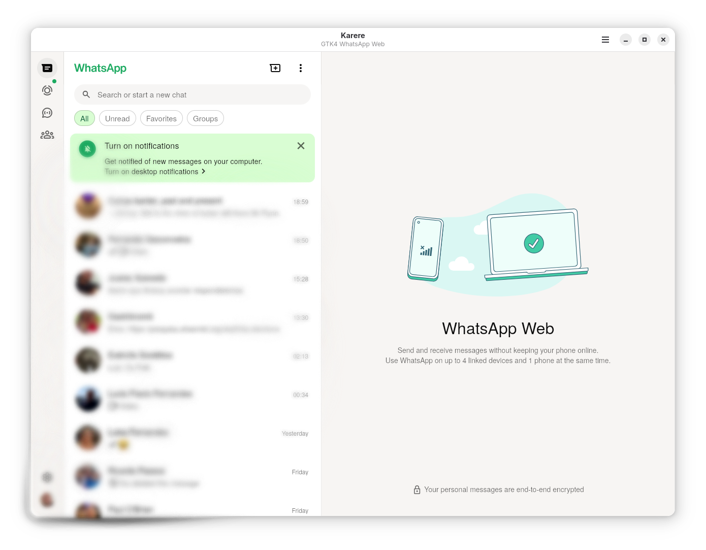

# Karere

A modern, native GTK4/LibAdwaita wrapper for WhatsApp Web that provides seamless integration with the Linux desktop environment.


## 🚀 Version 0.8.0 - Major Architecture Migration

**BREAKING CHANGE NOTICE:** Karere v0.8.0 represents a complete rewrite from Python to native Vala/GTK4 for superior performance and integration.

### ⚠️ Important Migration Information

- **Mobile Re-sync Required**: After upgrading to v0.8.0, you **must re-sync your mobile device** with WhatsApp Web as this is a completely new application implementation
- **Settings Reset**: Previous application settings will not be transferred - you'll need to reconfigure preferences
- **Performance Boost**: Expect significantly improved startup time, memory usage, and overall responsiveness
- **Enhanced Features**: New native notification system, accessibility support, and keyboard shortcuts

### What Changed
- **Language**: Python 3 → Native Vala compilation
- **UI Framework**: GTK4 with modern LibAdwaita and Blueprint declarative UI
- **Build System**: setuptools → Meson with comprehensive toolchain
- **Performance**: Interpreted → Compiled native binary
- **Integration**: Enhanced desktop integration and accessibility

## Features

- **Native Desktop Integration**: True native notifications using GNotification, not browser notifications
- **LibAdwaita Theming**: Full support for Light, Dark, and System themes with native styling
- **WebKitGTK Optimization**: Efficient resource usage compared to browser-based solutions
- **Spell Checking**: Multi-language spell checking support
- **Accessibility Support**: Comprehensive a11y features including:
  - Screen reader optimization with ARIA labels
  - Keyboard navigation support with focus indicators
  - High contrast mode support
  - Reduced motion support for animations
  - Configurable keyboard shortcuts
  - Focus chain management for keyboard-only navigation
- **Privacy Controls**: Granular settings for notifications and logging

## Installation

### Flatpak (Recommended)

#### Development Version
```bash
# Clone the repository
git clone https://github.com/tobagin/karere.git
cd karere

# Build and install development version
./scripts/build.sh --dev --install
```

#### Production Version (Coming Soon)
Karere is available on Flathub.

## Usage

### Basic Usage

Launch Karere from your applications menu or run:
```bash
karere
```

The application will load WhatsApp Web and provide native desktop integration.

### Preferences

Access preferences through the application menu or keyboard shortcut (`Ctrl+,`) to configure:

- **General**: Theme selection, developer tools
- **Accessibility**: Keyboard shortcuts, focus indicators, high contrast, reduced motion, zoom settings, screen reader optimization
- **Notifications**: Native notification preferences, preview settings, background notifications
- **Spell Checking**: Multi-language spell checking with auto-detect

### Keyboard Shortcuts

#### Standard
- `Ctrl+,` - Open Preferences
- `Ctrl+Q` - Quit Application
- `F1` - Show Keyboard Shortcuts Help

#### Zoom
- `Ctrl++` - Zoom In
- `Ctrl+-` - Zoom Out
- `Ctrl+0` - Reset Zoom

#### Developer (when enabled)
- `Ctrl+Shift+D` - Open Developer Tools
- `Ctrl+R` - Reload Page

#### WhatsApp Web
- `Ctrl+F` - Find in Chat
- `Ctrl+Shift+F` - Search Chats

### Accessibility Features

Karere includes comprehensive accessibility support:

- **Screen Reader Support**: Full ARIA labels and semantic HTML
- **Keyboard Navigation**: Complete keyboard-only navigation with visible focus indicators
- **High Contrast Mode**: Automatic detection and adaptation
- **Reduced Motion**: Respects system reduce-motion preferences
- **Configurable Shortcuts**: All keyboard shortcuts can be enabled/disabled
- **Focus Management**: 82 focusable elements in a logical focus chain

## Architecture

Karere is built using modern GNOME technologies:

- **Vala**: Primary programming language for type safety and productivity
- **GTK4**: Modern toolkit with excellent Wayland support
- **LibAdwaita**: Native GNOME design language and components
- **WebKitGTK 6.0**: Efficient web rendering engine
- **Blueprint**: Declarative UI definition language
- **Flatpak**: Secure application distribution

## Privacy & Security

Karere is designed with privacy in mind:

- **Sandboxed**: Runs in a Flatpak sandbox with minimal permissions
- **Opt-in Telemetry**: All logging and crash reporting is disabled by default
- **Local Storage**: Uses standard user data directories, no external services
- **Transparent**: Open source code available for audit

## Contributing

Contributions are welcome! Please see our development documentation:

- [Development Setup](docs/DEVELOPMENT.md) - Setting up your development environment
- [Code Style Guide](docs/CODE_STYLE.md) - Coding standards and conventions
- [Architecture Overview](docs/ARCHITECTURE.md) - Technical architecture details

### Development Workflow

1. Fork the repository
2. Create a feature branch
3. Make your changes
4. Run tests: `meson test -C build`
5. Submit a pull request

## Documentation

- [User Documentation](docs/) - User guides and help
- [Development Documentation](docs/DEVELOPMENT.md) - Developer resources
- [Flathub Compliance](docs/FLATHUB_COMPLIANCE.md) - Distribution requirements

## License

Karere is licensed under the GNU General Public License v3.0 or later. See [LICENSE](LICENSE) for the full license text.

## Support

- **Bug Reports**: [GitHub Issues](https://github.com/tobagin/karere/issues)
- **Discussions**: [GitHub Discussions](https://github.com/tobagin/karere/discussions)
- **Documentation**: [Project Wiki](https://github.com/tobagin/karere/wiki)

## Acknowledgments

- **GNOME Project**: For the excellent GTK4 and LibAdwaita frameworks
- **WebKitGTK Team**: For the efficient web rendering engine
- **WhatsApp Inc.**: For WhatsApp Web
- **Vala Community**: For the productive programming language

## Screenshots

| Main Window | About Dialog |
|-------------|--------------|
|  |  |

| Preferences | Shortcuts |
|-------------|-----------|
|  |  |

---

**Karere** - Native WhatsApp Web client for Linux desktop environments.
