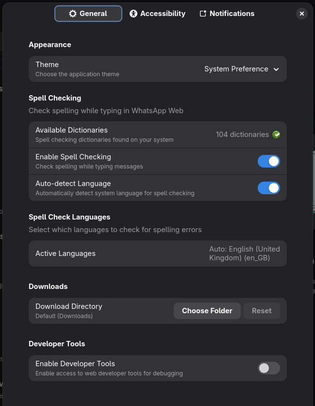

# Karere

A modern, native GTK4/LibAdwaita wrapper for WhatsApp Web that provides seamless integration with the Linux desktop environment.


## 🎉 Version 1.1.0 - Feature Release

**Karere 1.1.0** brings significant improvements including microphone support, background startup, and performance optimizations.

### ✨ Key Features

- **🎤 Microphone Support**: Native permission handling for voice messages
- **🚀 Background Start**: Option to launch silently in background
- **⚡ Performance**: Faster startup/shutdown and responsive UI
- **✅ Working Notifications**: WhatsApp notifications work perfectly with proper banner persistence
- **🖼️ Image Paste**: Ctrl+V works for both text and images in WhatsApp Web
- **📥 Download Manager**: Custom download directory with toast notifications

### 🆕 What's New in 1.1.0

- Added microphone permission support
- Added manual and auto-reload capabilities
- Fixed startup freezes and dictionary loading
- Added MPRIS workaround documentation

For detailed release notes and version history, see [CHANGELOG.md](CHANGELOG.md).

## Features

### Core Features
- **Native Desktop Integration**: True native notifications using GNotification with persistent permission state
- **WhatsApp Web Integration**: Full WhatsApp Web functionality with proper notification handling
- **LibAdwaita Theming**: Full support for Light, Dark, and System themes with native styling
- **WebKitGTK Optimization**: Efficient resource usage with persistent storage for cookies and sessions
- **Image & Text Paste**: Seamless Ctrl+V support for both images and text content
- **Download Manager**: Custom download directory selection with completion notifications

### Accessibility Support
- **Screen Reader Optimization**: Full ARIA labels and semantic HTML
- **Keyboard Navigation**: Complete keyboard-only navigation with visible focus indicators (82 focusable elements)
- **High Contrast Mode**: Automatic detection and adaptation
- **Reduced Motion**: Respects system reduce-motion preferences
- **Configurable Shortcuts**: All keyboard shortcuts can be enabled/disabled
- **Focus Management**: Logical focus chain for efficient navigation

### Spell Checking
- **Multi-Language Support**: 80+ dictionaries from LibreOffice
- **Auto-Detection**: Automatically detect language from system locale
- **Manual Selection**: Choose specific languages for spell checking
- **Real-time Checking**: Inline spell checking as you type

### Privacy & Customization
- **Granular Notification Controls**: Customize notification behavior and previews
- **Privacy Settings**: Control data logging and crash reporting
- **Theme Selection**: Choose between Light, Dark, or System theme
- **Zoom Control**: Configurable WebView zoom (disabled by default)

## Installation

### Flatpak (Recommended)

#### From Flathub
```bash
flatpak install flathub io.github.tobagin.karere
```

#### Development Version
```bash
# Clone the repository
git clone https://github.com/tobagin/karere.git
cd karere

# Build and install development version
./scripts/build.sh --dev
```

**Note**: After installation, you'll need to scan the QR code with your mobile WhatsApp to connect.

## Usage

### Basic Usage

Launch Karere from your applications menu or run:
```bash
flatpak run io.github.tobagin.karere
```

The application will load WhatsApp Web and provide native desktop integration.

### Preferences

Access preferences through the application menu or keyboard shortcut (`Ctrl+,`) to configure:

- **General**: Theme selection, developer tools
- **Accessibility**: Keyboard shortcuts, focus indicators, high contrast, reduced motion, zoom settings, screen reader optimization
- **Notifications**: Native notification preferences, preview settings, background notifications
- **Spell Checking**: Multi-language spell checking with auto-detect

### Keyboard Shortcuts

#### Standard
- `Ctrl+,` - Open Preferences
- `Ctrl+Q` - Quit Application
- `F1` - Show Keyboard Shortcuts Help

#### Zoom
- `Ctrl++` - Zoom In
- `Ctrl+-` - Zoom Out
- `Ctrl+0` - Reset Zoom

#### Developer (when enabled)
- `Ctrl+Shift+D` - Open Developer Tools
- `Ctrl+R` - Reload Page

#### WhatsApp Web
- `Ctrl+F` - Find in Chat
- `Ctrl+Shift+F` - Search Chats

### Accessibility Features

Karere includes comprehensive accessibility support:

- **Screen Reader Support**: Full ARIA labels and semantic HTML
- **Keyboard Navigation**: Complete keyboard-only navigation with visible focus indicators
- **High Contrast Mode**: Automatic detection and adaptation
- **Reduced Motion**: Respects system reduce-motion preferences
- **Configurable Shortcuts**: All keyboard shortcuts can be enabled/disabled
- **Focus Management**: 82 focusable elements in a logical focus chain

## Architecture

Karere is built using modern GNOME technologies:

- **Vala**: Primary programming language for type safety and productivity
- **GTK4**: Modern toolkit with excellent Wayland support
- **LibAdwaita**: Native GNOME design language and components
- **WebKitGTK 6.0**: Efficient web rendering engine
- **Blueprint**: Declarative UI definition language
- **Flatpak**: Secure application distribution

## Privacy & Security

Karere is designed with privacy in mind:

- **Sandboxed**: Runs in a Flatpak sandbox with minimal permissions
- **Opt-in Telemetry**: All logging and crash reporting is disabled by default
- **Local Storage**: Uses standard user data directories, no external services
- **Transparent**: Open source code available for audit

## Known Limitations

### Video Attachments
Due to compatibility limitations between WebKitGTK and WhatsApp Web, **video attachments are currently not supported**. This is a platform-level limitation that affects all WebKitGTK-based browsers (including GNOME Web/Epiphany).

**What works:**
- ✅ Text messages
- ✅ Image attachments
- ✅ Document attachments
- ✅ Audio messages
- ✅ Downloading videos sent by others

This limitation is being tracked and will be resolved if/when WebKitGTK adds better support for WhatsApp Web's video processing APIs.

### MPRIS and WebKit Issue
There is a known issue with MPRIS and WebKit that causes a bug on Karere! See [WebKit Bug 282000](https://bugs.webkit.org/show_bug.cgi?id=282000).

As a workaround you can disable MPRIS for the application of your interest.
To do this, create the file `/etc/dbus-1/session.d/block-karere-mpris.conf` with this content:

```xml
<busconfig>
  <policy context="mandatory">
    <deny own_prefix="org.mpris.MediaPlayer2.io.github.tobagin.karere"/>
  </policy>
</busconfig>
```

**Note:** This will block all instances of Karere from registering on MPRIS, because it uses the `own_prefix` prefix which also covers Sandboxed instances. It requires a system reboot or session restart to work.


## Contributing

Contributions are welcome! Please see [CONTRIBUTING.md](CONTRIBUTING.md) for guidelines on:

- Setting up your development environment
- Code style and conventions
- Testing and building
- Submitting pull requests
- Reporting bugs and feature requests

For questions or discussions, please use [GitHub Discussions](https://github.com/tobagin/karere/discussions).

## License

Karere is licensed under the GNU General Public License v3.0 or later. See [LICENSE](LICENSE) for the full license text.

## Support

- **Bug Reports**: [GitHub Issues](https://github.com/tobagin/karere/issues)
- **Discussions**: [GitHub Discussions](https://github.com/tobagin/karere/discussions)

## Acknowledgments

- **GNOME Project**: For the excellent GTK4 and LibAdwaita frameworks
- **WebKitGTK Team**: For the efficient web rendering engine
- **WhatsApp Inc.**: For WhatsApp Web
- **Vala Community**: For the productive programming language

## Screenshots

| Main Window | About Dialog |
|-------------|--------------|
|  |  |

| Preferences | Shortcuts |
|-------------|-----------|
|  |  |

---

**Karere** - Native WhatsApp Web client for Linux desktop environments.
